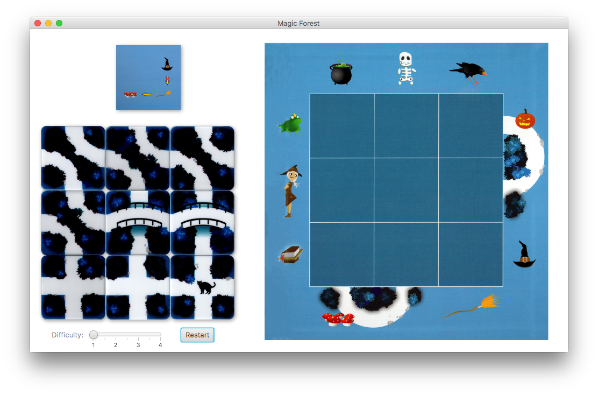
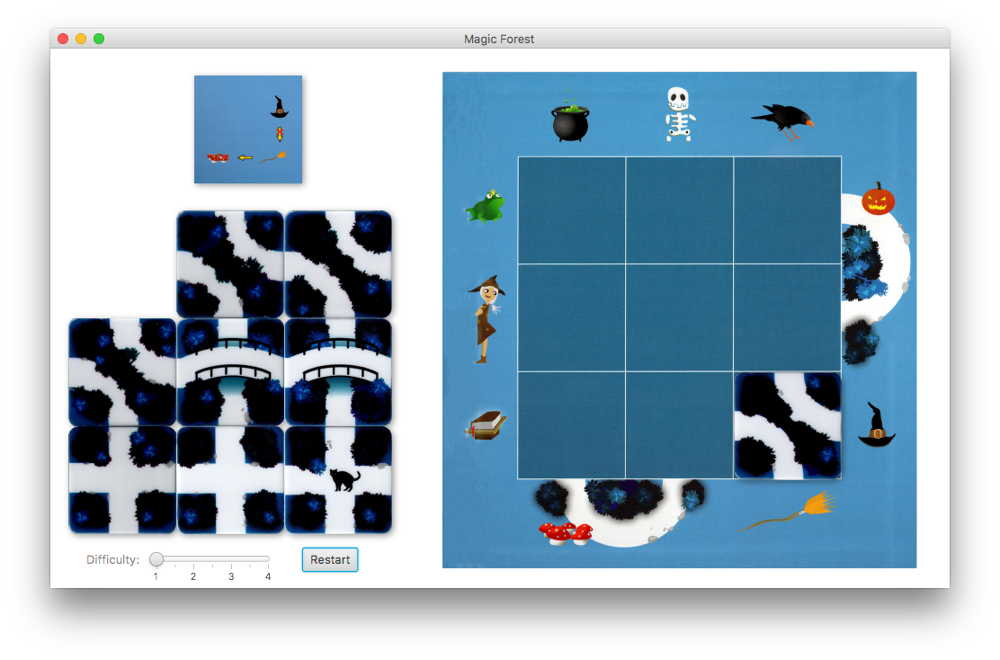
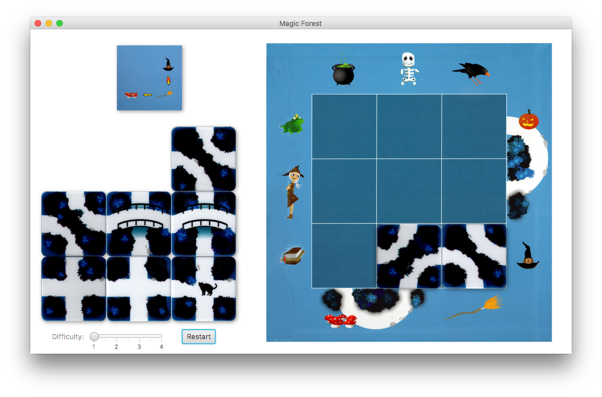
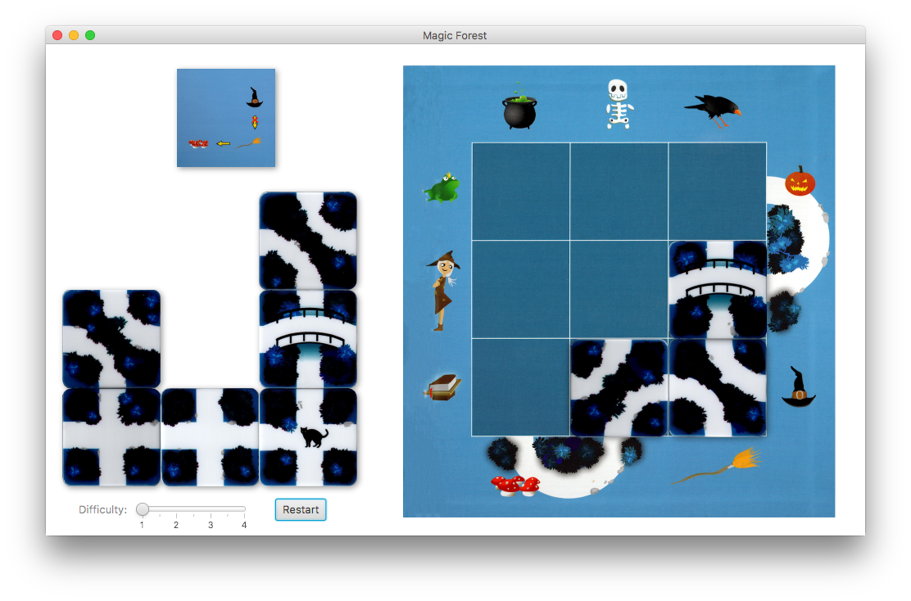
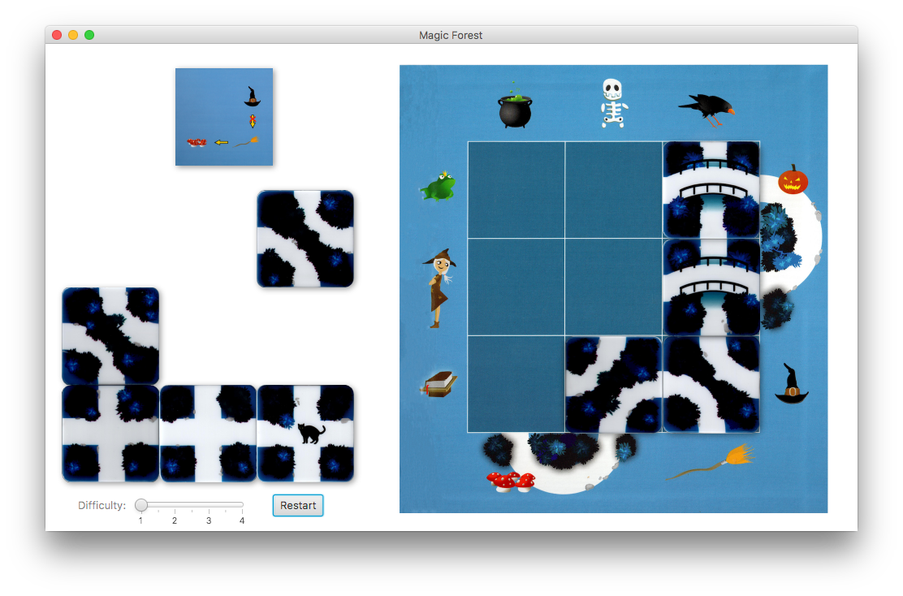
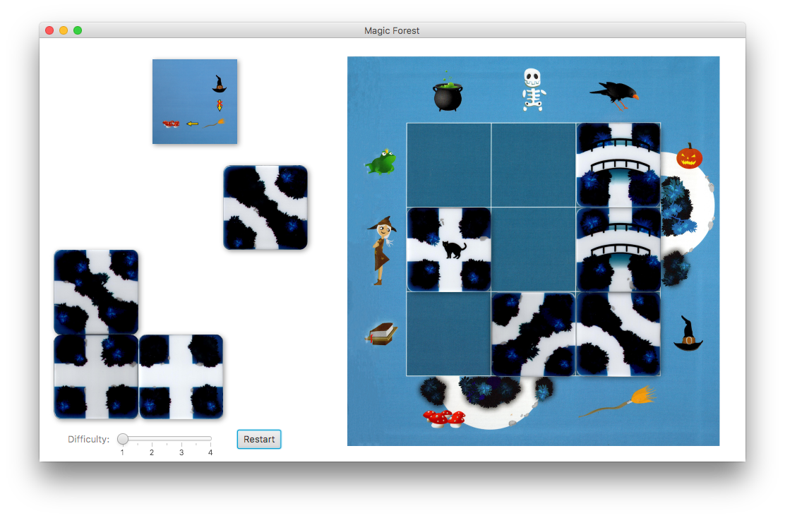
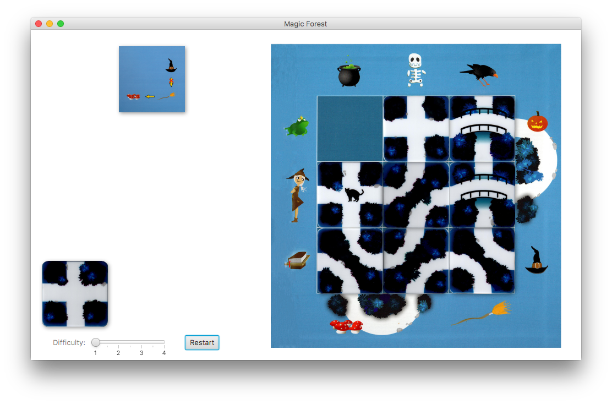
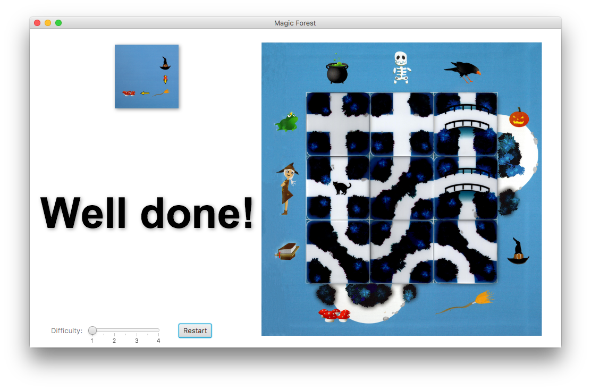

# COMP1110 Assignment 1

## Academic Honesty and Integrity

Honesty and integrity are of utmost importance. These goals are *not* at odds
with being resourceful and working collaboratively. You *should* be resourceful
and you should discuss the assignment
and other aspects of the course with others taking the class. However, *you must
never misrepresent the work of others as your own*. If you have taken ideas from
elsewhere or used code sourced from elsewhere, you must say so with *utmost
clarity*. At each stage of the assignment you will be asked to submit a statement
of originality, either as a group or as individuals. This statement is the place
for you to declare which ideas or code contained in your submission were sourced
from elsewhere.

Please read the ANU's [official position](http://academichonesty.anu.edu.au/) on
academic honesty. If you have any questions, please ask me.

Carefully review the [statement of originality](originality.md) which you must
complete.  Edit that statement and update it as you complete the assignment,
ensuring that when you complete the assignment, a truthful statement is committed
and pushed to your repo.

## Purpose

In this assignment is introductory, helping you gain familiarity with the basics
of Java, but doing so in the context of slightly larger piece of code.  Most
of the assignment is composed of a series of small tasks.

## Assignment Deliverable

The assignment is worth 5% of your total assessment, and it will be marked out
of 5. However, these marks are [redeemable](https://cs.anu.edu.au/courses/comp1110/assessments/redeemable/) by the exam, so if your exam mark / 20
is higher than your assignment one mark, you will get the exam mark / 20 rather
than the assignment one mark. **The mark breakdown is described on the
[deliverables](https://cs.anu.edu.au/courses/comp1110/assessments/deliverables/#D1A) page.**

The assignment is due at **[08:45 Friday Week 3](https://www.timeanddate.com/worldclock/fixedtime.html?msg=Assignment+1+Due&iso=20180809T2245&p1=%253A), 10 August 2018** ([time remaining](https://www.timeanddate.com/countdown/generic?p0=1440&iso=20180809T2245&msg=Assignment%201%20Due)).
You can find [this deadline](https://cs.anu.edu.au/courses/comp1110/assessments/deliverables/#D1A)
on the [deliverables page](https://cs.anu.edu.au/courses/comp1110/assessments/deliverables/), where all assignment deadlines for this semester are
listed.
Your tutor will mark your assignment by accessing your GitLab repository, so it is essential that you carefully follow
instructions for setting up and maintaining your repository. You will be marked
according to **whatever is committed to your repository at the time of the deadline**.
Since the first assignment is redeemable, **[late extentions
are not offered and will not be given](https://cs.anu.edu.au/courses/comp1110/deadlines/)**. As always, throughout the course, if
some significant circumstance arises outside of the course that affects your capacity to complete the course, please carefully follow the ANU's [special consideration process](http://www.anu.edu.au/students/program-administration/assessments-exams/special-assessment-consideration), and your circumstances will be accounted for in your final assessment.

## Overview

The assignment is based on a simple children's puzzle called
[Magic Forest](http://www.smartgames.eu/en/smartgames/magic-forest),
made by [SmartGames](http://www.smartgames.eu), a producer of
educational games.  The design of the game and all of the imagery in
this assignment comes from their Magic Forest game.

The game is played by placing
[*9 tiles*](/../blob/master/src/comp1110/ass1/Tile.java) on a 3x3
grid.  The game consists of
[*11 icons*](/../blob/master/src/comp1110/ass1/Icon.java), 10 of which
are *fixed* at positions on the perimeter of the 3x3 grid, and one of
which (the
[cat](/../blob/master/src/comp1110/ass1/gui/assets/I.png))
is both a tile *and* an icon.

The goal of the game is to place the tiles in such a way as to create
paths that meet a given objective, which will be expressed in terms of
icons that *must* be connected by a path, and icons that must *not* be
connected by a path.   The game is successfully completed if *all* nine
tiles are placed *and* the objective is met.

The game comes with 48 pre-defined objectives, organized as four
difficulty levels from *starter* to *master*.

Each time the game is played the objective may be different.
Some objectives are easier to solve than others.   The game is designed so
that the player may specify a difficulty level.  In the real game there are 
four difficulty levels, each with around a dozen different possible objectives.
In our version, the user may select the level of difficulty on a slider.

The images below show the progression of a simple game.

The game starts with an objective, which is displayed at the upper
left.  The objective states which icons *must* be connected and which
icons *must not* be connected.  This objective happens to be
[objective 13](/../blob/master/src/comp1110/ass1/gui/assets/13.png) in
the game.  In this case, the broom and mushrooms *must* be connected
(yellow arrow), but the broom and the hat must *not* be connected (red
cross through arrow).

The player then starts placing tiles.   They place a curve-shaped tile that will
help ensure the hat and broom are not connected and will start creating a
connection between the broom and mushrooms.

The player then places another curve-shaped tile.   Now the broom and the
mushrooms are connected.   However, the problem is not solved, because
not only must they be connected, but *all tiles must be placed* as well
as having all objectives met.   Notice that the mushrooms are special,
because they effectively take two positions (21 and 22).  The pumpkin has
the same property, taking positions 9 and 14.  To complete the assignment
with a high mark, you'll have to work out a way to handle this irregularity.

The player then places a bridge tile in an effort to ensure that the hat
won't reach the broom.

The player places another bridge tile.  By doing this, the path from the
hat reaches the raven and the edge of the board, so the path is complete.
This means that we can be sure that the hat will not reach the broom,
no matter where the remaining five tiles are placed.   However, the game
is not finished until all tiles have been placed.   Since they won't change the
result in this case, the player can put the remaining tiles wherever they want.

The player places the cat tile.   Notice that the cat tile is special.   It is
both an icon (the cat) and a tile (an intersection).

The player places three more tiles.   The placements are unimportant
since the objective has already been met.

The player places the final piece and completes the game successfully.

The player can start a new game by selecting a difficulty level and
pressing the 'Restart' button.

If the player presses the `?` (or `/`) key, a solution to the current
objective will appear on the grid until they release the key.

If the player presses the `M` (or `m`) key, some lovely music will play.

### Your task

Unfortunately your version of the assignment has some missing code.
While the graphical user interface is complete, some of the important
logic is missing, so it won't work as described above.  It is your job
to fix the problems so that it works.  Do not change the code except
by following each of the assigned tasks.  When those tasks are
completed, the game will function correctly.  Check your changes by
using the provided unit tests (there are no tests for Task 13).

## Legal and Ethical Issues

First, as with any work you do, you must abide by the principles of
[honesty and integrity](https://cs.anu.edu.au/courses/comp1110/09-integrity/). I expect
you to demonstrate honesty and integrity in everything you do.

In addition to those ground rules, you are to follow the rules one would normaly
be subject to in a commercial setting. In particular, you may make use of the
works of others under two fundamental conditions: a) your use of their work must
be clearly acknowledged, and b) your use of their work must be legal (for example,
consistent with any copyright and licensing that applies to the given material).
**Please understand that violation of these rules is a very serious offence.**
However, as long as you abide by these rules, you are explicitly invited to
conduct research and make use of a variety of sources. You are also given an
explicit means with which to declare your use of other sources (via originality
statements you must complete). It is important to realize that you will be
assessed on the basis of your original contributions to the project. While you
won't be penalized for correctly attributed use of others' ideas, the work of
others will not be considered as part of your contribution. Therefore, these
rules allow you to copy another student's work entirely if: a) they gave you
permission to do so, and b) you acknowledged that you had done so. Notice,
however, that if you were to do this you would have no original contribution and
so would recieve no marks for the assigment (but you would not have broken any
rules either).
	
## Evaluation Criteria

**The mark breakdown is described on the
[deliverables](https://cs.anu.edu.au/courses/comp1110/assessments/deliverables/#D1A) page.**

**Pass**
* Tasks #1, #2, #3, #4, #5, and #6

**Credit**
* Tasks #7, #8, #9 and #10 *(in addition to all tasks required for Pass)*

**Distinction**
* Tasks #11 and #12 *(in addition to all tasks required for Credit)*

**High Distinction**
* Tasks #13 and #14 *(in addition to all tasks required for Distinction)*

**IMPORTANT NOTE:** *It is very important that you understand that you are* **not**
*required to complete all elements of the
assignment. In fact, you are not encouraged to pursue the Distinction and High
Distinction tasks unless you feel motivated and able to do so. Recall that the
assignment is redeemable against the exam. The last parts of the assignment are
significantly harder than the others, but together worth only one additional mark. I
don't encourage you to spend too much time on this unless you are enjoying the
challenge of solving these harder problems.  Solutions to tasks #13 and #14 may
involve ideas that I have* **not covered**, *or not covered deeply in class; you may
need to go beyond the course material.*
